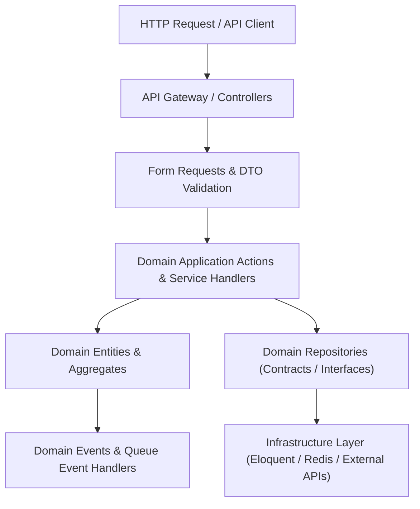

# 🏛️ Laravel 12 Enterprise Boilerplate (`laravel-12-enterprise`)

<p align="center">
  <a href="https://github.com/zyekhabdul/laravel-12-enterprise/actions/workflows/ci.yml">
    
  </a>
  <a href="LICENSE">
    
  </a>
  <a href="https://laravel.com/">
    
  </a>
  <a href="https://www.php.net/">
    
  </a>
  <a href="SECURITY.md">
    
  </a>
</p>

A production-ready, enterprise-grade Laravel 12 boilerplate built around **Domain-Driven Design (DDD)** principles, strict typing, Data Transfer Objects (DTOs), and automated testing (Pest/PHPUnit).

---

## 🏗️ Domain-Driven Design (DDD) Architecture



---

## 🚀 Key Features

- 🏛️ **Domain-Driven Design Structure**: Clear separation between Domain, Application, and Infrastructure layers.
- 📦 **Strict Typing & DTOs**: Spatie Data-style typed DTOs to eliminate array passing.
- 🔒 **Security First**: Prepared SQL, strict Content-Security-Policy middleware, and RBAC authorization.
- 🧪 **Automated Testing**: Pre-configured Pest / PHPUnit test suite for domain actions & API endpoints.
- 🐳 **Docker & Sail Ready**: Instant development environment setup using Docker Compose.

---

## 💻 Quick Start

```bash
# Clone repository
git clone https://github.com/zyekhabdul/laravel-12-enterprise.git
cd laravel-12-enterprise

# Install PHP dependencies
composer install

# Environment configuration
cp .env.example .env
php artisan key:generate

# Run database migrations & seeders
php artisan migrate --seed

# Start development server
php artisan serve
```

---

## 📜 License

MIT License © 2026 Zyekh Abdul Qadir Jailani.
